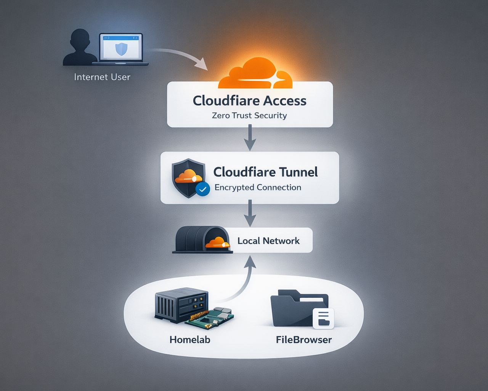

import { Steps, Aside } from 'astro-pure/user'

---

This guide provides a high-level, implementer-friendly overview of exposing *FileBrowser* through *Cloudflare Tunnel* and protecting it with *Cloudflare Access (Zero Trust)* using *Google* as an identity provider. It explains the why, the key concepts, recommended minimal flow, security checklist, and where to find official implementation references. This document is intentionally high-level with official cloudflare references for configurations.

---

## Why use Cloudflare Tunnel instead of port forwarding

Traditional remote access to homelab services typically relies on *router port forwarding*, which exposes a service directly to the internet. This approach increases the attack surface because the service becomes publicly reachable.

Cloudflare Tunnel works differently. The `cloudflared` daemon creates an outbound connection from your host to Cloudflare’s edge, which means:

- No *inbound ports* need to be opened on your router.
- Your public IP address remains hidden.
- Traffic reaches your service only through *Cloudflare’s network*.
- Additional protections such as *Cloudflare Access authentication* can be enforced before requests reach the origin.

This model significantly reduces direct exposure of homelab services compared to traditional port forwarding.

---

## Architecture
*Local FileBrowser → `cloudflared` (outbound tunnel) → Cloudflare network → Cloudflare Access (Login / Policy) → Browser (user)*

 

---

## Key concepts

- **Cloudflare Tunnel (cloudflared):** a lightweight daemon that creates outbound-only connections from your host to Cloudflare’s edge. Removes need for public IP or open inbound ports on your homelab.

- **Cloudflare DNS / Nameservers:** Full Setup means Cloudflare manages DNS for your zone (recommended for simplest Tunnel integration). Partial/CNAME setups are possible but limit automation and some features.

- **Cloudflare Access (Zero Trust):** enforces identity and policy checks at Cloudflare’s edge before allowing requests to reach your origin. Policies are rule-based (allow/deny/actions).

- **Identity Provider (Google OAuth):** Cloudflare integrates with Google Identity (standard OAuth/OIDC flow). Users authenticate with Google; Access applies policies (e.g., allow `*@yourdomain.com` or specific accounts).

---

## Minimal, high-level deployment flow
Present these as short steps; link to detailed appendix for commands.

<Steps>

1. *Add domain to Cloudflare* : register the zone in your Cloudflare account and choose Full Setup (Cloudflare will provide nameservers).
2. *Update nameservers at your registrar* : replace registrar nameservers with Cloudflare’s assigned nameservers (verify propagation).
3. *Create a Cloudflare Tunnel* : create the Tunnel in the Cloudflare dashboard and install `cloudflared` on the FileBrowser host. Configure the tunnel to route your subdomain (e.g., `files.shubhamranpise.com`) to FileBrowser’s local port.
4. *Configure DNS record for the subdomain* : point the subdomain to the Tunnel (Cloudflare can auto-create this when using Full Setup).
5. *Enable Cloudflare Access for the application* : create an Access application for the subdomain and attach policies.
6. *Add Google as an Identity Provider* : in Cloudflare One Integrations, add Google (or Google Workspace) with Client ID/Secret; choose the appropriate scope and any PKCE options if needed.
7. *Create Access policy rules* : e.g., require Google login and limit access to specific emails or groups; test login flow.

</Steps>

---

<Aside title='DNS / registrar note'>

- **Recommended** : If you want the simplest Tunnel experience and automatic DNS record creation, use *Full Setup* and point your domain's nameservers to Cloudflare's nameservers as provided in the dashboard.
- **Not-Recommended** : If you cannot change nameservers (registrar restrictions), you can use Partial/CNAME setups; expect extra manual DNS steps and reduced automation.

</Aside>

<Aside type="caution" title="Security & operational checklist">

- Use Full Setup if you want automated Tunnel/DNS management.
- Rotate API tokens and OAuth client secrets; store secrets in a vault (do not include them in repo files).
- Limit Access policies to the smallest set of users required (deny-by-default mentality).

</Aside>

---

## References (official docs)

- Cloudflare Tunnel overview & setup — https://developers.cloudflare.com/cloudflare-one/networks/connectors/cloudflare-tunnel/
- Quick setup & Tunnel creation — https://developers.cloudflare.com/tunnel/setup/
- Change your nameservers / Full Setup — https://developers.cloudflare.com/dns/zone-setups/full-setup/setup/
- Cloudflare Access (Policies overview) — https://developers.cloudflare.com/cloudflare-one/access-controls/policies/
- Google identity provider integration — https://developers.cloudflare.com/cloudflare-one/integrations/identity-providers/google/
- Tunnel FAQ and Partial vs Full setup notes — https://developers.cloudflare.com/cloudflare-one/faq/cloudflare-tunnels-faq/

---

This setup allows FileBrowser to be securely published to the internet without exposing your homelab directly, while Cloudflare Access ensures only authenticated users can reach the service.
