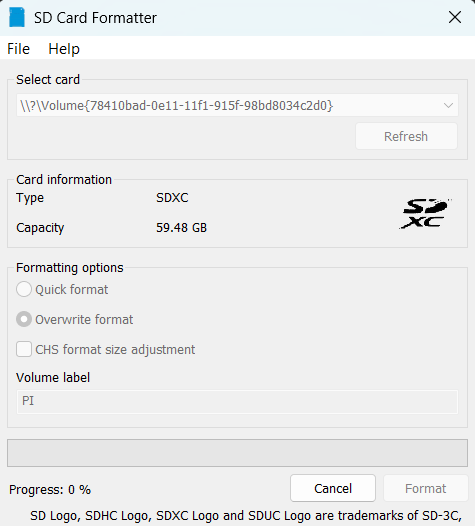
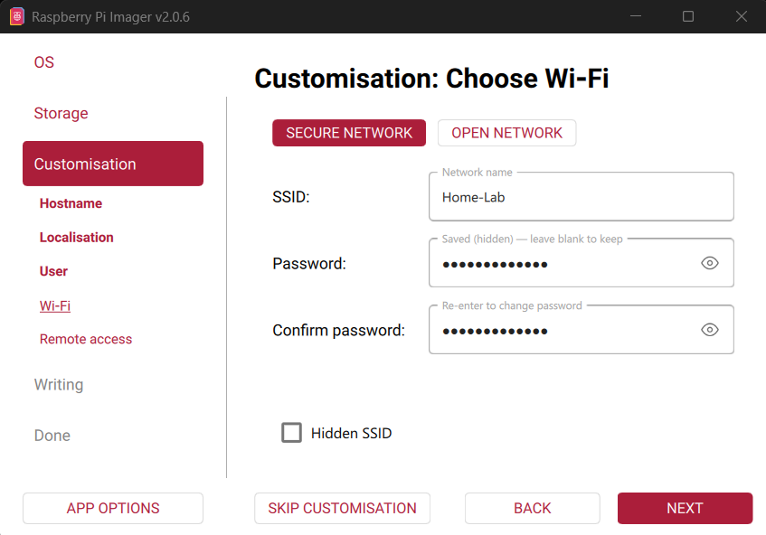
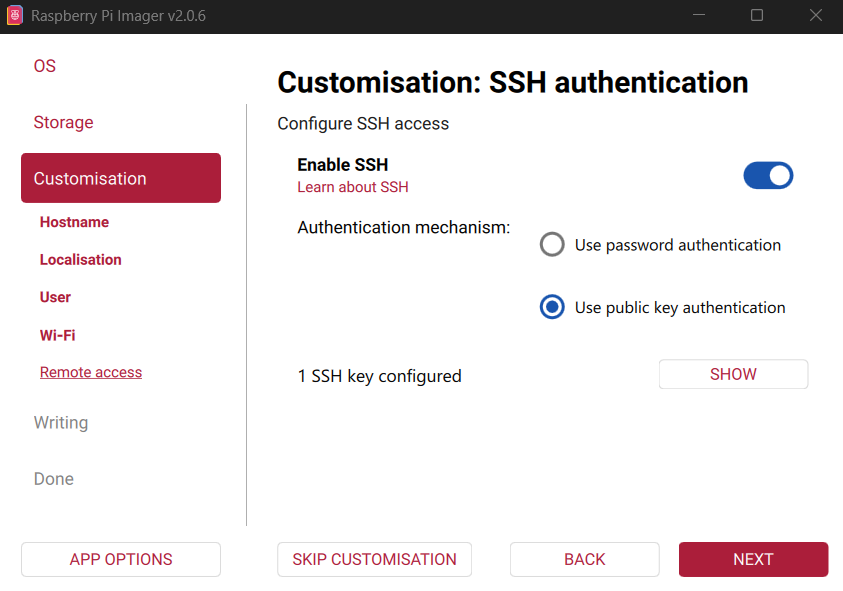
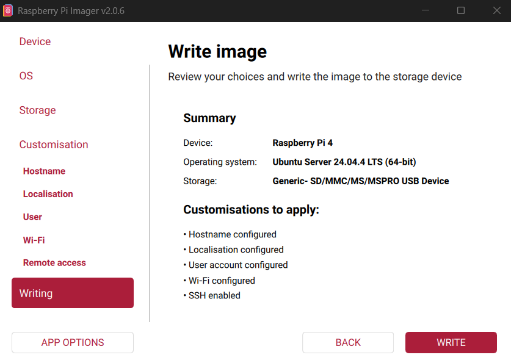

import { Aside, Steps } from 'astro-pure/user'

---

This article marks the starting point of my homelab journey. If you are new to self-hosting or Raspberry Pi projects, think of this as preparing the “base system” on which everything else will run.

Before installing applications, containers, VPNs, dashboards, or security tools, it is important to first build a reliable foundation. A poorly configured system can lead to instability, security issues, or constant maintenance later. This guide focuses on getting the core system right from the beginning so that future projects can be added safely and predictably.

The setup uses a Raspberry Pi running Ubuntu Server 24.04 LTS in a headless configuration, meaning the device runs without a monitor, keyboard, or mouse and is managed entirely over the network. This approach is typical for home servers because it reduces power usage, clutter, and attack surface while allowing the device to run continuously in the background.

By the end of this guide, the Raspberry Pi will function as a clean baseline server with essential protections and automation in place. It will not host any services yet instead, it will be ready for them.

This baseline includes:

- A fresh operating system installation
- Remote administration using secure SSH key authentication
- Disabled root login and hardened access settings
- A firewall restricting unsolicited inbound traffic
- Automatic installation of security updates
- Scheduled system maintenance
- Log size limits to prevent storage exhaustion


<Aside>  
In my setup, I use a dedicated `shub` user with sudo privileges and a hostname of `pi-lab`, but you can choose names and settings that match your own environment.

Once this foundation is complete, future articles in this series will build on it by adding networking tools, container platforms, monitoring systems, VPN access, and other self-hosted services.
</Aside>  

---

## Part 1: Preparing the SD Card

<Steps>

1.  **Format the SD Card**

    Insert the SD card into your computer and format it using your system’s disk utility or the SD Card Formatter tool.

    Starting with a clean card avoids boot problems caused by leftover partitions or corrupted data.

    


2.  **Write Ubuntu Server Using Raspberry Pi Imager**

    Download and launch the official Raspberry Pi Imager from the Raspberry Pi [website](https://www.raspberrypi.com/software/) and choose:

    Operating System: `Ubuntu Server 24.04 LTS (64-bit)`

    Ubuntu Server is lightweight, stable, and well suited for long-running services without a graphical interface.

    Select the correct SD card as the target device. The contents will be erased.

    


3.  **Select Target SD Card**

    Choose the correct storage device. Everything on it will be erased.

    


4.  **Set Hostname**

    I used below hostname for my machine:

    ```
    pi-lab
    ```

    You can choose any meaningful name. The hostname helps identify the device on your network, especially if you operate multiple systems.

    


5.  **Time Zone and Region**

    Select your local time zone.

    Accurate time is important for logs, updates, and secure connections.

    


6.  **Username and Password**

    Create your primary user account.

    I created:

    ```
    Username: shub
    ```

    Choose a strong password. This account will have administrative privileges via sudo and will be used for all management tasks.

    


7.  **Optional: Wi-Fi Configuration**

    If you are not using Ethernet, enter your Wi-Fi SSID and password so the device connects automatically on boot.

    Even when Ethernet is available, configuring Wi-Fi can be useful as a fallback.

    


8.  **Required: Generate an SSH Key**

    On your computer, generate an SSH key for the hostname that you set for your machine:

    ```bash
    ssh-keygen -t ed25519 -C "pi-lab"
    ```

    Accept the defaults and optionally set a passphrase.

    This key will be used for secure remote login without passwords.


9.  **Configure SSH in Imager**

    Enable SSH and select:

    `Use public key authentication`

    Paste your public key (typically from `~/.ssh/id_ed25519.pub`).

    This allows secure access immediately after the system boots.

    


10. **Write the Image**

    Confirm the summary and write the OS to the SD card. Wait for writing and verification to complete.

    


11. **First Boot and Connection**

    Insert the SD card into the Raspberry Pi and power it on.

    Wait a minute or two for the system to boot and obtain a network address.

    Find the IP address from your router or network scanner, then connect to your pi via ssh:

    ```bash
    ssh shub@192.168.1.69
    ```

    Use your SSH key and passphrase when prompted.
</Steps>

---

## Part 2: Baseline Security Configuration

### Disable the Root Account

```bash
sudo passwd -l root
```

Direct root login is unnecessary on modern Linux systems. Administrative tasks can be performed safely using sudo.

---

## Part 3: System Updates

<Steps>

1. **Enable Update Channels**

    Edit the repository configuration:

    ```bash
    sudo nano /etc/apt/sources.list.d/ubuntu.sources
    ```

    Find the line starting with `Suites:` and ensure it includes:

    ```
    Suites: noble noble-updates noble-security
    ```

    This enables both regular updates and security patches.


2. **Enable Automatic Security Updates**

    Install unattended upgrades:

    ```bash
    sudo apt install unattended-upgrades
    sudo dpkg-reconfigure --priority=low unattended-upgrades
    ```

    Choose `Yes` when prompted.

    Security patches will now install automatically in the background when available.


3. **Perform Initial Full Update**

    ```bash
    sudo apt update && sudo apt upgrade -y && sudo apt autoremove -y
    ```

    This brings the system completely up to date and removes unused packages.


4. **Install Basic Networking Tools**

    ```bash
    sudo apt install net-tools
    ```

    This package provides utilities such as `ifconfig`, which are helpful for troubleshooting.

</Steps>

---

## Part 4: Firewall Configuration

<Steps>

1. **Install UFW**

    ```bash
    sudo apt install ufw
    ```

2. **Set Secure Defaults**

    ```bash
    sudo ufw default deny incoming
    sudo ufw default allow outgoing
    ```

    All unsolicited inbound connections are blocked by default and outbound are allowed.


3. **Allow SSH Only From Trusted Devices**

    By default, the firewall blocks all incoming connections. We now explicitly allow SSH access, but only from devices that you trust, such as your laptop or another management machine on your network.

    Replace the IP address below with the address of your own device (Lan or VPN):

    ```bash
    sudo ufw allow from 192.168.1.10 to any port 22 proto tcp
    ```


4. **Enable the Firewall**

    ```bash
    sudo ufw enable
    sudo ufw status verbose
    ```

</Steps>

---

## Part 5: Harden SSH

SSH is the main way to manage the Raspberry Pi remotely, so it should be secured early.

Edit the SSH server configuration file:

```bash
sudo nano /etc/ssh/sshd_config
```

Ensure the following settings are present:

```
PasswordAuthentication no
PermitRootLogin no
PubkeyAuthentication yes
```

Restart the SSH service to apply the changes:

```bash
sudo systemctl restart ssh
```

After this step, only devices with the correct private key can log in.

<Aside>
These settings disable password-based logins and prevent direct root access, allowing only SSH key authentication.
</Aside>

---

## Part 6: Automatic Weekly Maintenance

Security updates are automatic, but full upgrades should still run periodically.

<Steps>

1. **Create Update Script**

    ```bash
    sudo nano /usr/local/bin/weekly-update.sh
    ```

    Paste:

    ```bash
    #!/bin/bash
    /usr/bin/apt update
    /usr/bin/apt upgrade -y
    /usr/bin/apt autoremove -y
    /usr/bin/apt autoclean
    ```

    Make it executable and restrict access:

    ```bash
    sudo chmod +x /usr/local/bin/weekly-update.sh
    sudo chmod 700 /usr/local/bin/weekly-update.sh
    ```


2. **Create Systemd Service**

    Create `/etc/systemd/system/weekly-update.service`:

    ```ini
    [Unit]
    Description=Weekly System Update

    [Service]
    Type=oneshot
    ExecStart=/usr/local/bin/weekly-update.sh
    User=root
    ```


3. **Create Timer**

    Create `/etc/systemd/system/weekly-update.timer`:

    ```ini
    [Unit]
    Description=Run weekly update

    [Timer]
    OnCalendar=weekly
    Persistent=true

    [Install]
    WantedBy=timers.target
    ```

    Enable the timer:

    ```bash
    sudo systemctl daemon-reload
    sudo systemctl enable --now weekly-update.timer
    systemctl list-timers
    ```

    Systemd timers are reliable and will run missed jobs after downtime.

</Steps>

---

## Part 7: Prevent Log Storage Exhaustion

System logs can grow indefinitely and fill the SD card if left unmanaged.

Edit journald configuration:

```bash
sudo nano /etc/systemd/journald.conf
```

Uncomment and set:

```
SystemMaxUse=200M
```

Restart logging:

```bash
sudo systemctl restart systemd-journald
```

---

From here, services such as Docker, VPNs, monitoring systems, and self-hosted applications can be installed on top of a well-prepared foundation.
