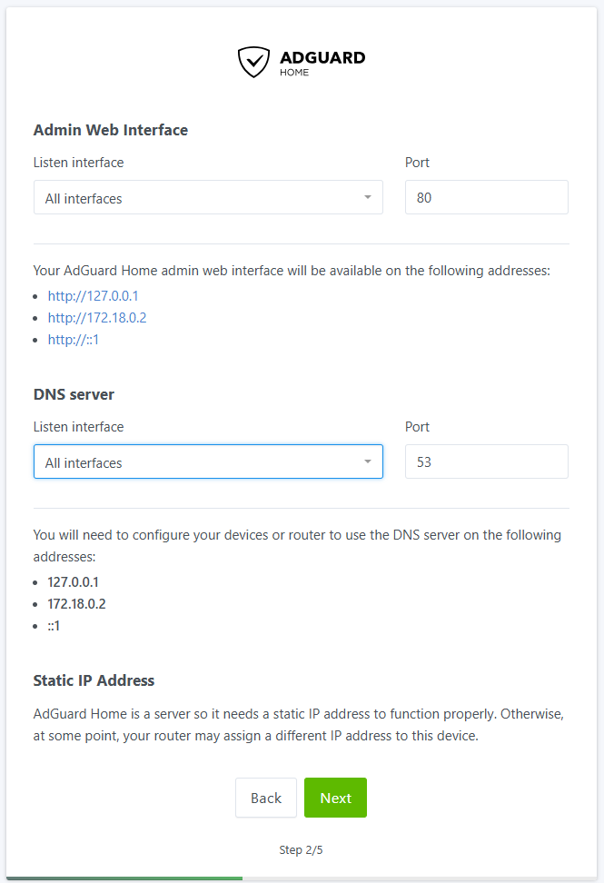
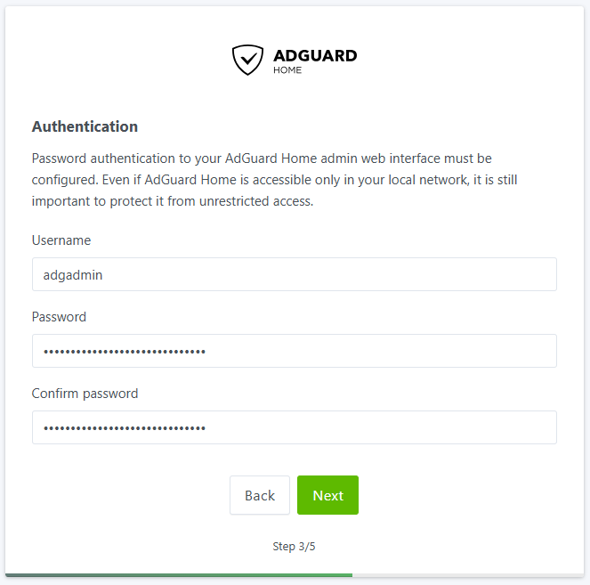
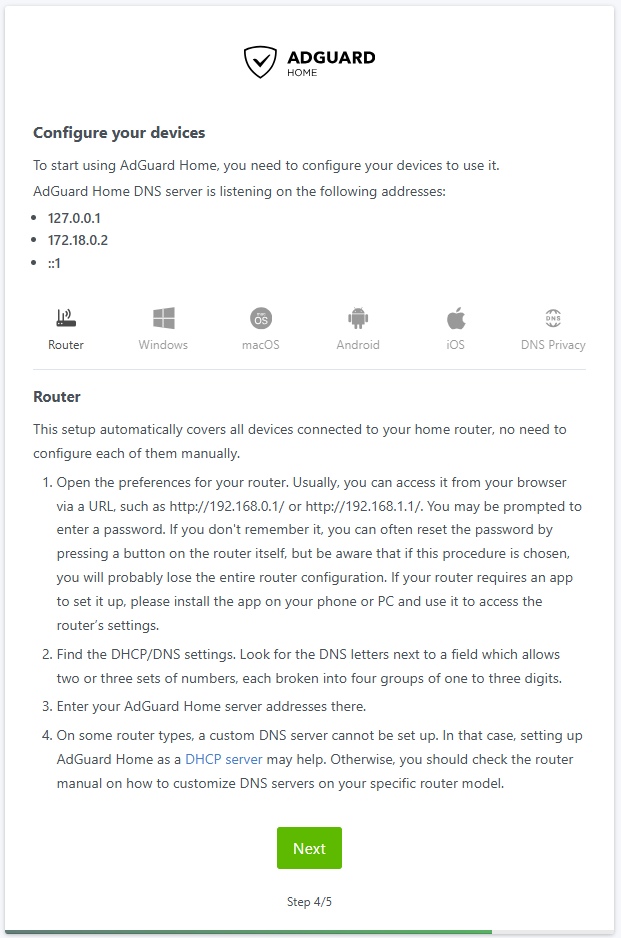
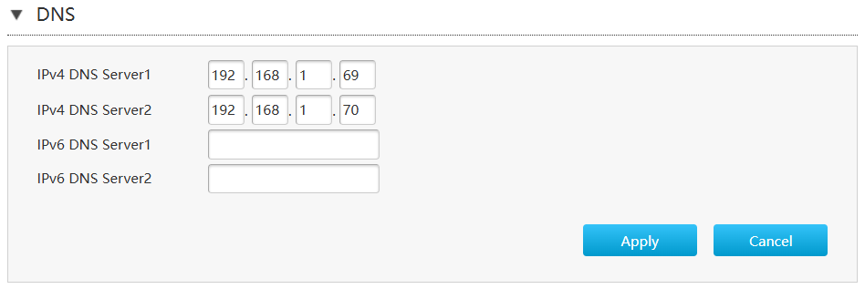
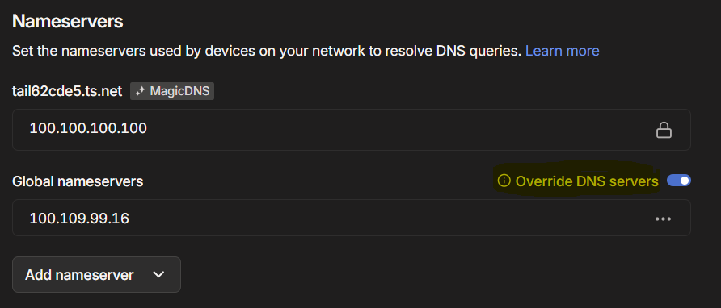
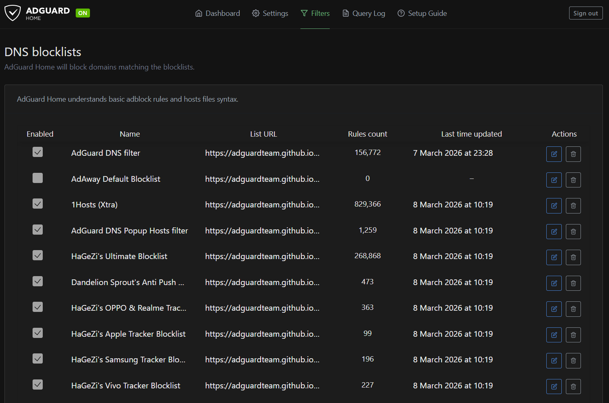
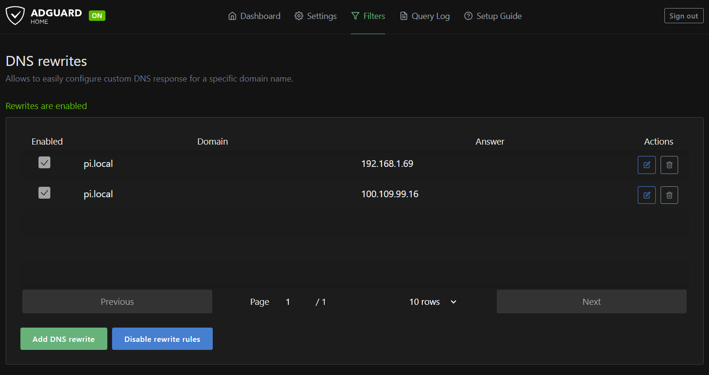

import { Aside, Steps } from 'astro-pure/user'

---

Deploy **AdGuard Home** in Docker using a dedicated service user `iamdocker`, complete the first-run setup UI, then enable HTTPS for the admin interface using a locally generated certificate stored in a mounted volume.

### Prerequisites

* Docker & Docker Compose installed on the host.
* Service account `iamdocker` that is a member of the `docker` group.
* Decide the host IP(s) or interfaces AdGuard will bind to.

### Directories (create as `iamdocker`)

```bash
sudo -u iamdocker mkdir -p /opt/dockerstacks/adguard/{confdir,workdir,certs}
```

### docker-compose — first run (setup UI)

Create `/opt/dockerstacks/adguard/docker-compose.yml` for first-run UI exposed on port 3000.     
    (port 3000 will removes after setup).

```yaml
services:
  adguardhome:
    image: adguard/adguardhome:latest
    container_name: adguardhome
    restart: unless-stopped
    networks:
      - agh-bridge
    ports:
      # DNS (bind only to interfaces you intend to serve)
      - "100.109.X.X:53:53/tcp"
      - "100.109.X.X:53:53/udp"
      - "192.168.X.X:53:53/tcp"
      - "192.168.X.X:53:53/udp"

      # Admin UI (HTTP)
      - "100.109.X.X:11080:80/tcp"
      - "192.168.X.X:11080:80/tcp"

      # First-run setup UI — remove after initial configuration
      - "100.109.X.X:3000:3000/tcp"
      - "192.168.X.X:3000:3000/tcp"

    volumes:
      - /opt/dockerstacks/adguard/workdir:/opt/adguardhome/work
      - /opt/dockerstacks/adguard/confdir:/opt/adguardhome/conf

networks:
  agh-bridge:
    driver: bridge
```

Start docker container as `iamdocker`.

```bash
sudo -u iamdocker docker compose -f /opt/dockerstacks/adguard/docker-compose.yml up -d
```
**Access the setup wizard via the initial UI port (e.g., `http://<host-ip>:3000`).**
<Steps>

    1. **Click Get started**.
    2. **Verify DNS listen interfaces/Admin Web interfaces and ports; adjust if needed.**

        

    3. **Set admin username/password.**

        
    
    4. **Configure DNS distribution (router, Tailscale, or per-device).**   
        Recommendation: set a reliable secondary DNS (e.g., `9.9.9.9`) as a fallback.

        

        **Router Configuration**

        

        **If using Tailscale, enable `Override local DNS` to push AdGuard to your tailnet.**

        

    5. **Complete the wizard. The service will restart automatically on your set port number.**

</Steps>

### Remove setup UI (port 3000)

After initial setup, stop the stack, remove port `3000` entries from `docker-compose.yml`, then restart.

```bash
sudo -u iamdocker docker compose -f /opt/dockerstacks/adguard/docker-compose.yml down
# edit compose file to remove the 3000 ports
sudo -u iamdocker docker compose -f /opt/dockerstacks/adguard/docker-compose.yml up -d
```

### Minor configuration changes (example)

- **Blocklists:** Navigate to Filters > DNS Blocklists. Subscribe to additional lists (e.g., AdGuard's default DNS blocklist, plus StevenBlack or OISD for comprehensive coverage). Enable and apply.

    

- **DNS Rewrites:** Under Settings > DNS Rewrites, add entries for local resolution     
    (e.g., pi.local → 192.168.X.X and 100.109.X.X for seamless access to the Pi).   
    This simplifies internal navigation without public DNS reliance.

    


### Enable HTTPS on Admin UI (self-signed)

<Steps>

    1. Stop the stack and edit docker-compose.yml to add HTTPS ports and certs volume.

        ```bash
        sudo -u iamdocker docker compose -f /opt/dockerstacks/adguard/docker-compose.yml down
        ```

        ```yaml
        services:
        adguardhome:
            image: adguard/adguardhome:latest
            container_name: adguardhome
            restart: unless-stopped

            networks:
            - agh-bridge

            ports:
            # DNS (unchanged)
            - "100.109.X.X:53:53/tcp"
            - "100.109.X.X:53:53/udp"
            - "192.168.X.X:53:53/tcp"
            - "192.168.X.X:53:53/udp"
            - "192.168.X.X:53:53/tcp"
            - "192.168.X.X:53:53/udp"

            # Admin UI HTTP (redirects to HTTPS)
            # - "100.109.X.X:11080:80/tcp"

            # Admin UI HTTPS (Limited to VPN for secuirty)
            - "100.109.X.X:11443:443/tcp"

            volumes:
            - /opt/dockerstacks/adguard/workdir:/opt/adguardhome/work
            - /opt/dockerstacks/adguard/confdir:/opt/adguardhome/conf
            - /opt/dockerstacks/adguard/certs:/opt/adguardhome/certs # New volume

        networks:
        agh-bridge:
            driver: bridge
        ```

    2. Generate self-signed certificate as `iamdocker`.

            Change the `pi.local` with your local DNS address.

        ```bash
        sudo -u iamdocker openssl req -x509 -nodes -days 365 \
        -newkey rsa:2048 \
        -keyout /opt/dockerstacks/adguard/certs/adguard.key \
        -out /opt/dockerstacks/adguard/certs/adguard.crt \
        -subj "/CN=pi.local"
        ```

    3. Configure AdGuard to use the cert 

            edit `/opt/dockerstacks/adguard/confdir/AdGuardHome.yaml` and update the `tls` block.

        ```yaml
        tls:
        enabled: true
        force_https: true
        port_https: 443
        certificate_path: /opt/adguardhome/certs/adguard.crt
        private_key_path: /opt/adguardhome/certs/adguard.key
        ```

    4. Restart the stack

        ```bash
        sudo -u iamdocker docker compose -f /opt/dockerstacks/adguard/docker-compose.yml up -d
        ```

    5. Access the `https://<host-ip>:11443`. Browsers will warn for a self-signed certificate; import the `.crt` into clients you control or replace with a CA-signed cert.

</Steps>

### Recommendation: production / public access

For public exposure, terminate TLS at a reverse proxy (Caddy/Traefik/Nginx with ACME). Let the proxy handle certificates and proxy traffic to AdGuard’s admin port. Disable AdGuard's internal TLS in that configuration.

<Aside type='danger' title='Operational notes & hardening'>

- Expose the AdGuard admin UI only on a restricted interface to reduce the attack surface. Access should preferably be limited through a VPN.
- Bind port 53 only to necessary interfaces. Exposing DNS to untrusted networks increases attack surface.
- If port 53 is already in use (e.g., systemd-resolved), stop or reconfigure the host resolver before starting AdGuard.
- Store certificates with restricted permissions (`iamdocker` owner).
- Keep a fallback resolver configured on clients to avoid total loss of DNS when the Pi is offline. 

</Aside>

---

AdGuard Home is now running as a containerized DNS service in the homelab.

All devices on the LAN and Tailscale network can now use the Pi for centralized DNS filtering and resolution.